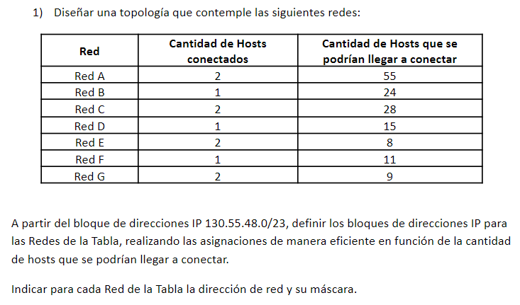
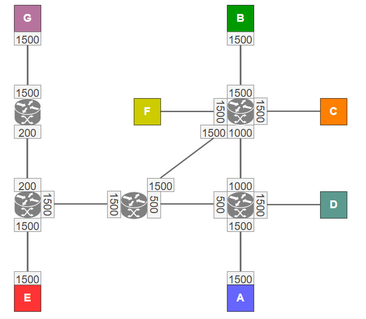

---

# COMUNICACIÓN DE DATOS - TP LAN

- #### Alumno: Lautaro De Lucía
- #### Padrón: 100203
- #### Fecha: 06/11/2023

---

Dada la máscara $/23$, determinamos el espacio designado para **red** y **host** respectivamente:

$D: 130.55.48.0/23$
$B: 10000010.00110111.00110000.00000000$
$M: \red{1111111}.\red{11111111}.\red{1111111}\blue{0}.\blue{00000000}$
$B \& M: \red{10000010}.\red{00110111}.\red{0011000}\blue{0}.\blue{00000000}$

Tenemos un total de 9 dígitos para sub-netting y asignación de hosts.

Como ningúna red excede un umbral de $2^6=64$ hosts a conectarse, podemos utilizar los dígitos $7$, $8$ y $9$ para el subnetting, obteniendo de esa forma 7 redes con espacio para 64 hosts para cada uno.  Sin embargo, esta ***no*** es una asignación ***eficiente***, ya que tenemos información de la cantidad de límite de hosts para cada red, siendo muchas de estas muy inferiores a 64 hosts.

Si queremos hacer una asignación eficiente, conviene determinar el tamaño mínimo de máscara de sub-red para cada Red:

|$Red$| $MaxHosts$ | $MinBits$ | $Máscara$ | $Rango \ Total$ |
|--- |---|---| --- | --- |
| A | 55  | 6 | /26 | 64 |
| B | 24 | 5 | /27 | 32 |
| C | 28 | 5 | /27 | 32 |
| D | 15 | 5 | /27 | 32 |
| E | 8 | 4 | /28 | 16 |
| F | 11 | 4 | /28 | 16 |
| G | 9 | 4 | /28 | 16 |

- ***Obs***
Notar que utilizamos 32bits para la red D, ya que una máscara de sub-red de 16 bits solo permite 14 espacios para hosts, teniendo que reservar 2 espacios para red y broadcast respectivamente. El Rango para la identificación de hosts implica restar 2 a el rango total.

Luego, podemos hacer un sub-netting de la forma:

| $Red$  | $Dirección$ | $Rango$ |
| --- | --- | --- |
| $A$  | $130.55.48.0/26$ | $130.55.48.0 - 130.55.48.63$ |
| $B$ | $130.55.48.64/27$ | $130.55.48.64 - 130.55.48.95$ |
| $C$ | $130.55.48.96/27$ |  $130.55.48.96 - 130.55.48.127$ |
| $D$ | $130.55.48.128/27$ |  $130.55.48.128 - 130.55.48.159$ |
| $E$ | $130.55.48.160/28$| $130.55.48.160 - 130.55.48.175$ |
| $F$ | $130.55.48.176/28$ | $130.55.48.176 - 130.55.48.191$ |
| $G$ | $130.55.48.192/28$| $130.55.48.192 - 130.55.48.207$ |

Como criterio de diseño, consideramos preferible que todas las interfaces en una ruta específica tengan el mismo MTU. Esto a modo de evitar la fragmentación de paquetes, que puede causar una sobrecarga innecesaria y potencialmente reducir el rendimiento.

Con esto, encontramos que la cantidad mínima de routers que nos permiten obtener un diseño que cumpla con todos los requisitos es cinco. 

A continuación, se muestra un diagrama que muestra la topología de nuestra red. Es fácil ver que se cumplen las condiciones de el enunciado.

La topología en IMUNES es la de la figura:

Donde se definen sub-redes *punto a punto* $H,I,J,K,L$ para los enlaces entre routers.

|Red|Dirección|Rango|
|---|---|---|
| $H$ | $130.55.48.208/30$ |  $130.55.48.208 - 130.55.48.211$ |
| $I$ | $130.55.48.212/30$| $130.55.48.212 - 130.55.48.215$ |
| $J$ | $130.55.48.216/30$ | $130.55.48.216 - 130.55.48.219$ |
| $K$ | $130.55.48.220/30$| $130.55.48.220 - 130.55.48.223$ |
| $L$ | $130.55.48.224/30$| $130.55.48.224 - 130.55.48.227$ |
